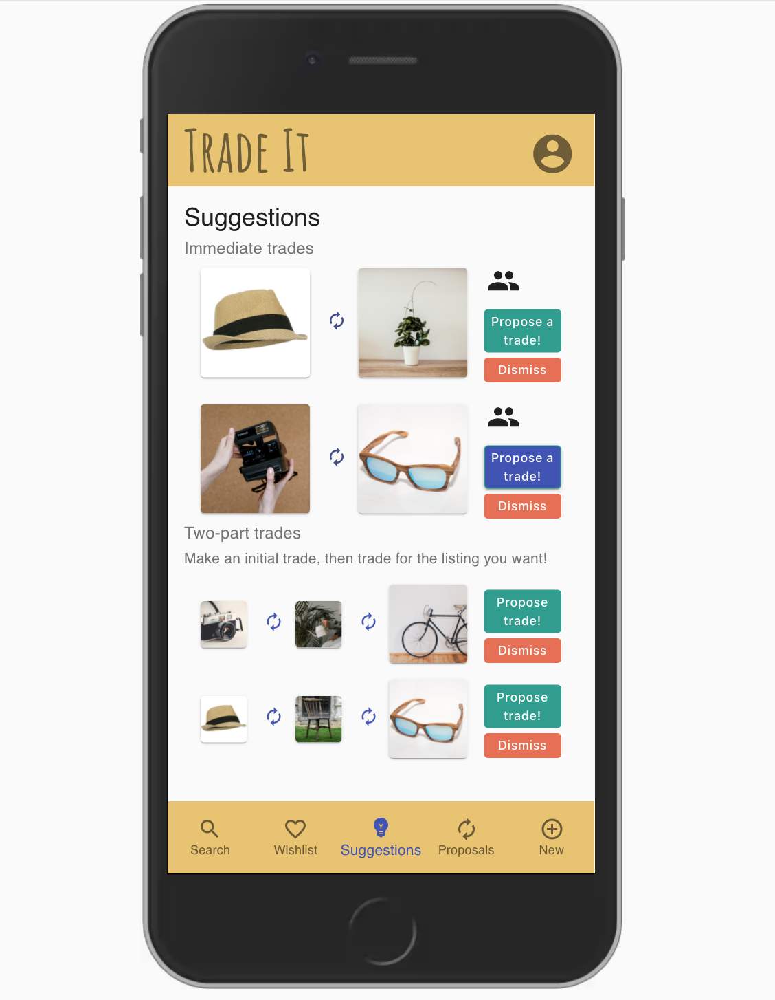

# Trade it

A mobile app for trading items you no longer need for others you want. Don't buy, just trade it and help create a more sustainable future. 
I came out with the idea for this app idea inspired by the story of Kyle Macdonald. Kyle had a red paper clip, he started a chain of trades with it, and after 14 trades he managed to get a house.  
Back-end: Rails, PostgreSQL.  
Front-end: React, CSS, Material UI, Ant Design. 

Group project with Thomas Weideman [@tw77](https://github.com/tw77). Final project for [Lighthouse Labs](https://www.lighthouselabs.ca/)

### My contribution
- Pair programmed to build the back end with Ruby on Rails.
- Pair programmed to create the database with PostgreSQL and migrations with Rails.
- Worked with React to build the components using Material UI and Ant Design.
- Styled the app with CSS, Bootstrap, and build-in style from Material UI and Ant Design.

## How it works

  #### Browse and search for items
  

  #### Go to a particular listing page
  

  #### Go to a user profile page
    

  #### Propose a trade
    

  #### Manage proposals & leave a review
    

  #### Wishlist page
    

  #### Add a new listing
    

  #### Suggestions page
    

## Setup
1. Fork this repository, then clone your fork of this repository.
2. In one terminal, run `bundle` to install the dependencies. Run `bin/rake db:setup` to create the databases (called rails_project_development). Run `bin/rails s` to run the server.
3. In the other terminal, `cd` into `client`. Run `npm install`. Then run `npm start`.
4. Go to `localhost:3000` in your browser.
